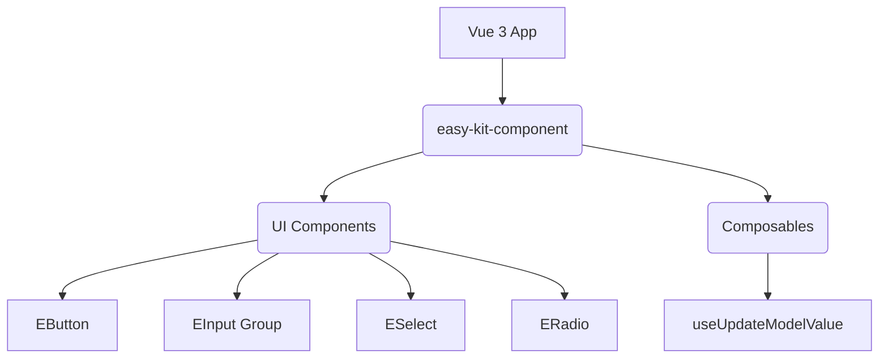

# easy-kit-component

## Overview

### Project Name
easy-kit-component

### Project Description
Simple component kit for Vue 3. It provides a set of basic UI components built with Vue 3 and TypeScript, designed to be easily integrated into any Vue project.

## Architecture



### Project Structure
- `src/components/`: Contains the Vue 3 UI components (button, input, radio, select).
- `src/composables/`: Contains reusable Composition API logic (e.g., v-model update helpers).
- `docs/`: VitePress documentation for the component kit.
- `src/index.ts`: The main entry point exporting all components.

### Technology Stack
- Vue
- TypeScript
- Vite
- Vitest
- VitePress

### High-level Components

#### UI Components

##### Repository Location
`src/components/`

##### Description
A collection of essential, basic UI components (such as buttons, text inputs, checkboxes, color pickers, date pickers, radios, and selects) designed for simple and seamless integration in Vue applications. 

##### API / Interface / Contracts specification
Each component defines its own `Props` interface using TypeScript (e.g., `EButton` accepts `type`, `disabled`, `formId`, `autoFocus`). Components emit `update:modelValue` events to support two-way data binding (`v-model`) natively in Vue 3.

##### Dependencies and Integrations
- Integrates with Vue's reactivity system and component model.
- Internal components rely on reusable composables for event emission.

#### Composables

##### Repository Location
`src/composables/`

##### Description
Reusable composable functions that abstract the logic of extracting values from DOM events and emitting `update:modelValue` events for different types of inputs (text, checkboxes, radio boxes).

##### API / Interface / Contracts specification
Functions like `useUpdateModelText(event, emit)`, `useUpdateModelCheckbox(event, emit)`, and `useUpdateModelRadiobox(value, emit)` take standard DOM events or values and invoke the `emit` function with the standardized update payload.

##### Dependencies and Integrations
- Consumed internally by the various input components.
- Requires standard DOM `Event` types.

## Infrastructure

### Setup Instructions
Install the dependencies using the package manager defined in `package.json`:
```bash
pnpm install
```

### Local Development
To run the documentation dev server:
```bash
pnpm run docs:dev
```

To build the library and generate types:
```bash
pnpm run build
```

To run tests:
```bash
pnpm run test
```

## Development Guidelines

### Coding Standards
- Write components in Vue 3 using the Composition API with `<script setup lang="ts">`.
- Define component props with explicit TypeScript interfaces.
- Define a separate `<script lang="ts">` block to explicitly export the component name.
- Export all components from `src/index.ts` to be included in the bundle.
- Use `happy-dom` and `vitest` for writing and running component tests.
- Maintain proper typings for Vue components using `vue-tsc` and `vite-plugin-dts`.
